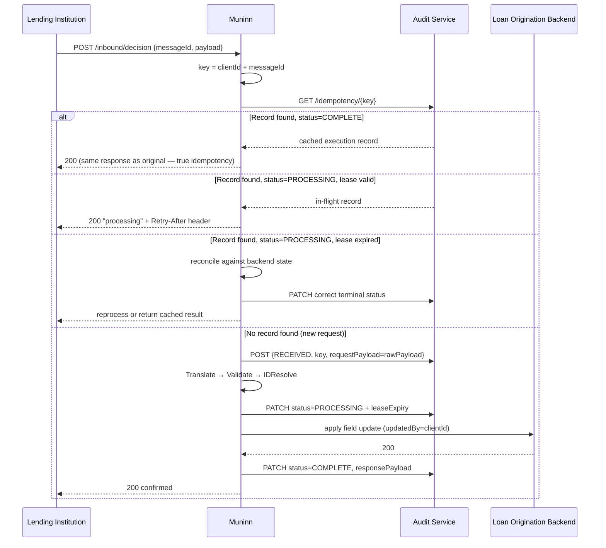
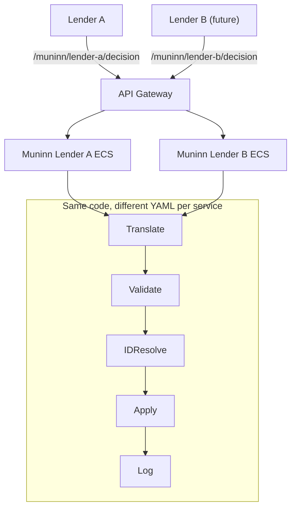
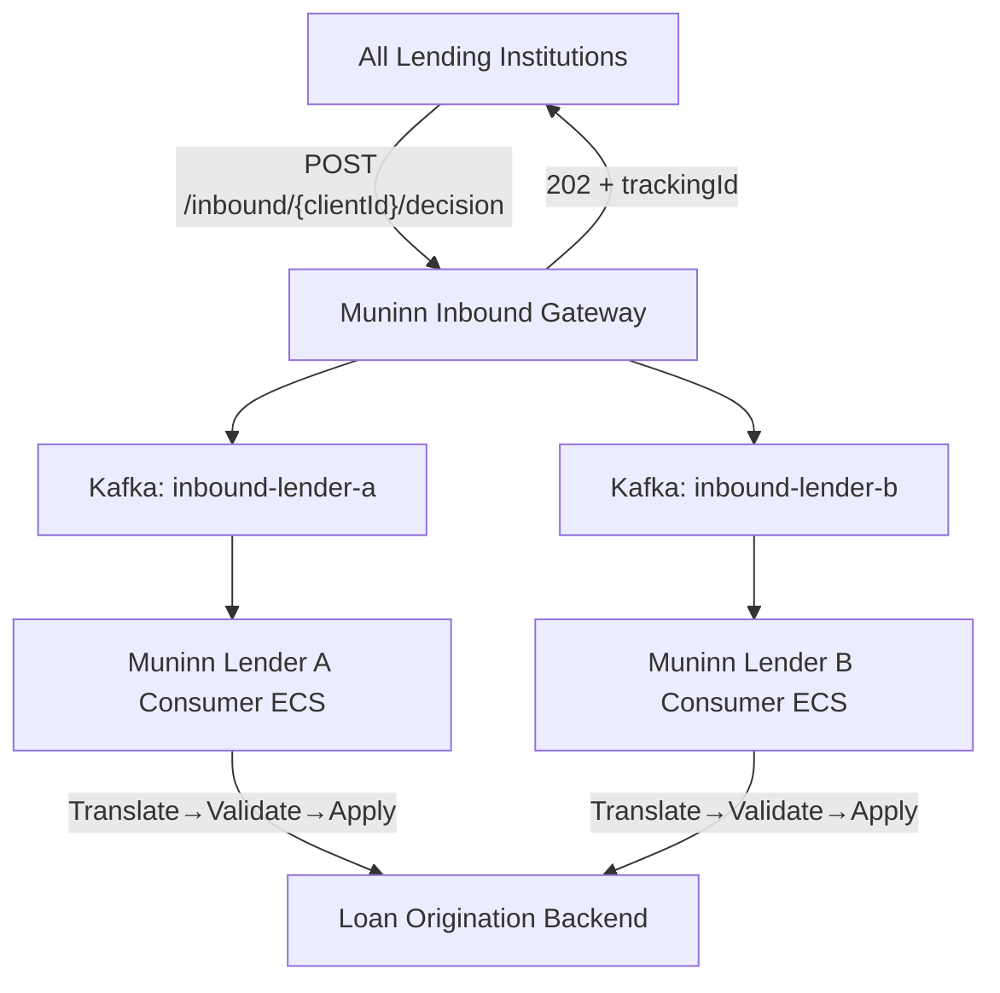
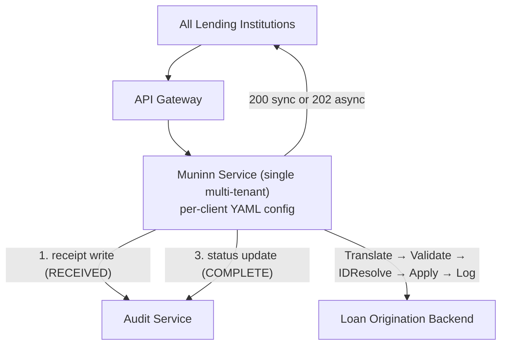
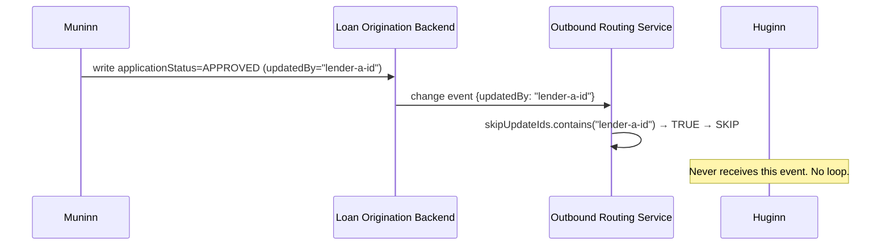

# Huginn and Muninn: Designing a Governed Inbound Data Integration Pipeline

_A system design case study exploring the architecture of an inbound integration framework for a loan origination platform — covering distributed systems tradeoffs, idempotency design, field ownership governance, and the cautionary tale of a bidirectional integration that went badly wrong._

---

## Background

Most integration teams spend the majority of their time thinking about outbound data — getting records out of your system of record and into third-party systems reliably, at scale, with good observability. The outbound problem is well-solved: event-driven pipelines using change data capture, per-tenant Kafka consumers, config-driven enrichment and delivery stages. You write something, a pipeline notices, it delivers it.

The inbound problem is harder and far less discussed. When third-party systems need to push updates _back into_ your system of record — decisions, status changes, approvals, denials — you face a genuinely difficult set of distributed systems challenges: idempotency, field ownership, race conditions, audit trails, and the ever-present risk of creating a feedback loop between your outbound and inbound pipelines.

This document describes the design of **Muninn** — an inbound integration pipeline built as the complement to an existing outbound pipeline called **Huginn**. The domain is loan origination: a platform that submits loan applications to external lending institutions, receives credit decisions back, and must maintain a reliable, auditable, conflict-free record of both.

The design principles are broadly applicable to any system that receives governed updates from external sources. The distributed systems problems here — idempotency, field ownership, write skew, loop prevention — are not domain-specific.

---

## On Naming Systems

The naming is intentional, and the convention matters enough to explain.

In Norse mythology, Huginn and Muninn are Odin's two ravens. Each morning he sends them out across the nine worlds; by nightfall they return and perch on his shoulders, whispering what they have seen. **Huginn** means _Thought_ — intention and information flowing outward into the world. **Muninn** means _Memory_ — knowledge returning home.

The metaphor is exact: Huginn carries loan application data outward to lenders. Muninn carries their decisions back.

This follows the principle of _ubiquitous language_ from Domain-Driven Design. Compare:

> _"Is this a Huginn issue or a Muninn issue?"_

versus:

> _"Is this the outbound integration messaging pipeline or the inbound decision update service controller?"_

The first takes one second to parse. The second takes five seconds and still leaves room for confusion. Named systems create shared vocabulary, build team ownership, and give new engineers an intuitive mental map they can orient around immediately. When you name a family of systems around a coherent theme, each new system inherits that orientability for free. A third pipeline in this family — something transactional, maybe, sitting between outbound and inbound — would naturally suggest itself as Odin: the consciousness at the center, making decisions based on what his ravens have told him.

Invest in the name. It costs nothing and pays dividends in clarity for the life of the system.

---

## Problem Statement

We need an inbound counterpart to Huginn. External lending institutions — underwriters, banks, credit bureaus, and fulfillment partners — send us data in the form of credit decisions, status changes, and responses. We need to receive that data, validate and translate it, and apply the updates back to our loan origination system of record.

Core assumptions:

- Data **already exists** in our system of record; these are always **updates**, never creates. (Loan applications are created through a separate API layer.)
- Updates originate externally via HTTP push, polling, or event stream.
- The target record ID must be resolved from the inbound payload — external systems use their own identifiers.
- The first concrete use case is a single upstream lending institution sending credit decisions back to us. The system must scale to many more.

**Goal:** A paved road that the integrations team reaches for the same way they reach for Huginn for outbound — config-driven, per-client isolated, observable at every stage, and designed to last.

---

## The Core Problem: Governing Inbound Updates

Before getting into architecture, it is worth naming the fundamental challenge that makes inbound integrations hard.

Outbound integrations have a natural owner: you. Your system of record is the source of truth, and you push derived data outward. The data ownership is unambiguous.

Inbound integrations break that assumption. A third party wants to update fields in _your_ system of record. The questions that follow are surprisingly difficult:

- **Which fields are they allowed to update?** A field not in their allowlist should be unreachable, not just unenforced.
- **What if your system and their system both write the same field simultaneously?** You have a race condition with no deterministic winner.
- **What if their update fails to apply?** Does your system diverge silently from theirs?
- **What if they send the same update twice?** Is your consumer idempotent?
- **What if the loan application they're updating was cancelled while they were reviewing it?** Do you apply a credit decision to a dead record?

These are the questions Muninn is designed to answer structurally, not operationally. The goal is to make the wrong thing impossible — or at least loudly visible — rather than relying on process to catch it.

---

## Conceptual Foundation — Named Patterns

This section establishes shared vocabulary grounded in well-known literature. Not all of these patterns are v1 scope — some are reference points for where the design is headed.

### Enterprise Integration Patterns (Hohpe & Woolf)

**Pipes and Filters** — Muninn's stage sequence (`Translate → Validate → IDResolve → Apply → Log`) is Pipes and Filters. Each stage is a filter; the canonical `InboundUpdate` model is the pipe. Stages are composable, replaceable, and testable in isolation. You can add a new stage — a fraud-signal enrichment step, say, or a duplicate detection layer — without touching any other stage's logic.

**Message Translator** — the Translate stage. Maps client-specific format to a canonical internal model. The essential first principle: normalize before you process. Enum mapping (e.g., a lender's `"APPROVED"` → internal `ApplicationStatus.APPROVED`) is translation, not validation. Validation operates on canonical values; translation produces them.

**Canonical Data Model** — the `InboundUpdate` model Muninn produces after translation. One internal representation all external formats converge to, making all downstream stages client-agnostic. A debate worth having: should this be an industry-standard wire format (e.g., a published JSON schema)?

The answer is: at the transport boundary, yes — recommending a standardized schema to new clients signals maturity and reduces translation complexity. Internally, no. Standard wire formats carry structural overhead (envelopes, metadata, extensions) that adds no value once the message has been parsed. The internal model should be lean and domain-specific. Making a standard format mandatory would also exclude legacy clients — exactly the ones who most need a paved road.

**Idempotent Receiver** — the consumer must produce the same result regardless of how many times it receives the same message. Non-optional when at-least-once delivery is in play: HTTP retries guarantee re-delivery. This must be implemented correctly — see the Idempotency section below, which covers two common implementation mistakes and their fixes.

**Transactional Inbox** (Idempotent Receiver + Message Store) — persist the inbound message to durable storage _before_ any processing. Enables crash recovery, idempotency enforcement, and replay. The "transactional" label is slightly misleading — see the dedicated Idempotency section for what this guarantee actually covers and where it doesn't.

**Content-Based Router** — Huginn routes outbound change events to per-client Kafka topics based on the content of the event (client identity, changed fields). This is how it achieves per-client isolation — and how Muninn prevents creating a feedback loop. See Loop Prevention.

**Correlation Identifier** — `eventId` + `objectId` in the audit service. Traces a single transaction across all systems: Muninn's ingestion log and Huginn's outbound log both index on the same `objectId`, enabling end-to-end correlation across inbound and outbound for any loan record.

---

### Designing Data-Intensive Applications (Kleppmann)

**At-least-once delivery + idempotent consumer = effectively-once** — HTTP retries guarantee at-least-once. The only correct response is to make the consumer idempotent. Without idempotency, a network retry causes a duplicate write. "We'll just make sure clients don't retry" is not an operational model.

**Write skew** — a lender reads their system state, generates a credit decision, sends it to us. If we've modified the same record since they read it, their decision is based on stale state. The practical mitigation is a client-provided sequence number. For the first integration specifically, the practical answer is a deliberate policy — _their value wins for the fields they own_ — because they are the authoritative decision-maker for those fields. For future integrations with less clear field ownership, a sequence number is a hard requirement. The important thing is that this is _explicit policy_, not silent assumption.

**Last-write-wins is unreliable** — wall-clock timestamps do not work for conflict resolution across distributed systems. Clock skew and NTP drift mean two independently-timestamped events are not reliably ordered. Without explicit version numbers, last-write-wins is the de facto policy and must be explicitly acknowledged — not silently assumed — in the integration design document.

**Event sourcing (adjacent pattern)** — Muninn does not implement full event sourcing, but the transactional inbox with raw payload storage moves meaningfully in that direction. Every inbound event is persisted before processing — a durable log of what was received and when. This is enough to replay missed updates and reconstruct state for any record.

---

### Software Architecture: The Hard Parts (Ford, Richards, Sadalage, Dehghani)

**Service granularity** — per-client ECS services (the Huginn model) are the right granularity for isolation: independent deployability, independent scaling, independent fault domains. Muninn starts as a single multi-tenant service and evolves to per-client isolation incrementally, using the same deployment pattern.

**Data domain ownership** — "whoever owns the data owns the write." Field allowlists in YAML config are the implementation. A lending institution owns the fields they're the authoritative source for; they are granted write access to those fields and only those fields. Structural enforcement is better than process enforcement.

**Orchestration vs. choreography** — Muninn uses orchestration: a central pipeline coordinator calls each stage in sequence, handles failures at each step, and maintains a complete picture of the request. Choreography distributes control flow in a way that makes failures hard to trace. Since stages are inherently sequential and dependent — you cannot Apply before you IDResolve — orchestration is the natural fit. The observability service can then show exactly which stage failed and what the payload looked like at every step.

---

### Hexagonal Architecture / Ports and Adapters (Cockburn; Clean Architecture — Martin)

The pipeline stages are the **hexagon** (domain logic). Transport mechanisms are pluggable **adapters** (ports). The domain only ever sees the canonical `InboundUpdate`, regardless of whether it arrived via HTTP, Kafka, polling, or flat file. This is what makes the sync/async config flag work: the transport adapter changes; the domain stages are identical.

```
┌───────────────────────────────────────────────┐
│            Transport Adapters (Ports)         │
│  [HTTP webhook]  [Polling job]  [Flat file]   │
│            [Kafka consumer]                   │
└────────────────────┬──────────────────────────┘
                     │ canonical InboundUpdate
┌────────────────────▼──────────────────────────┐
│          Pipeline Stages (Domain)             │
│  Translate → Validate → IDResolve             │
│  → Apply → Log                                │
└────────────────────┬──────────────────────────┘
                     │
┌────────────────────▼──────────────────────────┐
│          Infrastructure Adapters              │
│  [loan origination platform write-back]       │
│  [observability / audit service]              │
└───────────────────────────────────────────────┘
```

---

### A Philosophy of Software Design (Ousterhout)

**Deep modules** — each per-client Translator has a simple interface (`translate(rawPayload) → InboundUpdate`) and complex internals that hide client-specific parsing. Complexity at the leaf, simplicity at the seam. The pipeline stages never know they're handling SOAP/XML from a 1990s mainframe — the Translator took care of it.

**Define errors out of existence** — the field allowlist makes certain error classes structurally impossible. If a client's allowlist does not include `disbursementDate`, the `disbursementDate` race condition cannot occur. No code needed to handle what cannot happen.

**Complexity is the enemy** — every abstraction layer adds cognitive overhead for every engineer who will maintain this system. This principle applies to the meta-question of whether to build Muninn at all for v1 — see Option D below.

---

## Partner Delta — The Cautionary Tale

Before describing what Muninn _is_, it is worth understanding what it is designed to prevent — a real integration failure that shaped every decision here.

Partner Delta was a bidirectional synchronization integration between the loan origination platform and an external loan management system operated by a major financial institution. It became a cautionary tale not because the engineers were careless, but because the integration was specced incorrectly from the start — and the code faithfully implemented a bad spec.

### What it was: two separate flows with no coordination

**Outbound:** Nine or more Huginn pipelines firing every time a loan application was submitted or updated — pushing application status, loan amounts, dates, applicant information, product codes, terms, lender and broker details to the external system.

**Inbound:** A manual pull. A user in the loan management UI would click "Refresh," which triggered a third-party case retrieval call → a bidirectional reconciliation service → which then overwrote nearly the same set of fields back into our system: application status, amounts, dates, applicant data, product codes, terms, and lender info.

These were the _exact same fields_ the nine outbound pipelines were constantly pushing _to_ Partner Delta. Both systems wrote everything. Neither owned anything.

### What this produced

The codebase became an 800-line reconciliation service with no stage boundaries, six or more feature flags patching edge cases the original design never anticipated, validation bypassed via undocumented runtime flags, and optimistic locking exceptions requiring a dedicated retry mechanism — because concurrent writes from the outbound pipeline and the inbound pull would frequently collide on the same record.

Every debugging session started from scratch because there were no named stages to isolate. Nobody could confidently answer "what is the validation contract?" because it was spread across runtime flags and conditionals. Failures were mysterious because there was no per-stage observability.

### The two layers of complexity

_Accidental complexity_ — things a well-designed framework like Muninn would fix:

- No stage boundaries meant every debugging session required reading the entire flow
- Feature flags as workarounds meant the effective validation contract existed nowhere explicitly
- No per-stage observability meant failures were mysterious and reproduction was unreliable

_Essential complexity_ — things no framework can fix:

If both systems can write the same fields, you have a distributed consistency problem. Muninn makes governance visible and structurally enforceable, but it cannot substitute for governance itself. The matching logic that mapped external loan references to internal records had three fallback strategies and still created duplicate records when all three failed — because the fundamental specification asked for something inherently difficult.

### The real lesson

The root cause was a spec that said "keep both systems perfectly in sync on everything" rather than "each system owns specific fields." That spec would have been painful to implement in any framework.

Muninn enforces field ownership structurally via the YAML allowlist — the act of filling in that config forces the question that was never asked with Partner Delta: _"should this client really be allowed to write this field?"_

> Every field a client can update in their system that also lives in ours is a field we must coordinate writes on across two distributed systems. The fewer shared writable fields, the more reliable both systems are. Ideally, each system is the sole authoritative writer for the fields it owns.

**The single-writer rule:** For every field involved in an integration, there should be exactly one authoritative writer. The first integration Muninn serves is designed correctly: the lender's credit decision fields (`applicationStatus`, `lenderReferenceId`, `decisionReason`) are set exclusively via Muninn and are not editable from within the platform UI. There is no race possible because our system never independently writes those fields.

---

## Recommended Client Integration Profile

This section captures the principled starting point for conversations with new integration clients. Lead with the ideal; negotiate down only where the client's system genuinely cannot accommodate it; document every deviation explicitly.

Muninn is flexible — it handles custom JSON, SOAP/XML, flat files, polling, and async or synchronous flows. That flexibility has a cost: the further a client deviates from the ideal, the more translation complexity Muninn must absorb and the more operational risk the integration carries.

### ✅ Required — non-negotiable

**1. HTTPS + OAuth2 Client Credentials**

Every client gets an OAuth2 application client (client ID + secret). All calls to Muninn must include a valid JWT. This is how we know who is calling, enforce per-client rate limits, and stamp `updatedBy` correctly for loop prevention. There is no alternative auth mechanism.

**2. Field ownership agreement before go-live**

Before a single line of code is written, agree in writing: _which fields does this client own?_ Their system is the authoritative writer for those fields; ours is not. Our outbound pipeline must not include those fields going the other direction. This is the single most important safeguard against recreating the Partner Delta failure mode. No go-live without it.

### 🟢 Strongly recommended

**3. A unique message ID on every payload**

The client generates a UUID for each inbound event and includes it in every payload. This is the key for Muninn's idempotency mechanism — if the same message arrives twice (network retry, duplicate send), Muninn returns the same cached response without reprocessing. Without a message ID, idempotency must fall back to a composite key (`clientId + recordId + statusValue + timestamp`), which is less reliable and can fail for byte-identical re-sends of genuinely distinct events. Push for this — it is easy for any modern system to implement.

**4. Minimum field surface — single-system mutability where possible**

Send only the fields the client is the authoritative source for. Not a full record sync. Every additional shared writable field is a coordination problem — the direct lesson from Partner Delta. Beyond minimizing field count, push for _single-system mutability_: the cleanest integration is one where the fields a client sends are _not editable from within our system at all_. This eliminates race conditions structurally rather than operationally.

**5. Sequence number for conflict detection**

If the client's system maintains a version or sequence number on its records, include it in the payload. Allows Muninn to detect write skew — if our record has advanced beyond the version the client based their update on, we surface the conflict rather than silently applying a stale update. For clients that cannot provide this, document that last-write-wins is the accepted policy.

### 🟡 Recommended

**6. Standardized JSON over HTTPS** — prefer a well-documented JSON schema agreed upon at integration design time. Prefer REST over SOAP. Prefer push over polling. Flat file delivery (SFTP, S3) is a last resort — it introduces polling complexity, latency, and provides no natural idempotency mechanism.

**7. Async response (202 + callback or status polling)** — decouples the client's send operation from processing time, absorbs burst traffic, and does not hold HTTP connections open during multi-step internal processing. Some clients require synchronous 200 — a real business constraint that Muninn supports via YAML config. For clients without this constraint, async is significantly more resilient.

**8. Retry with exponential backoff using the same message ID** — on error, retry with the original `messageId`, never a new one. A new message ID on a retry defeats idempotency: Muninn sees it as a new event and reprocesses.

### Deviation handling

When a client cannot meet a recommendation: document (1) which recommendation was declined and why, (2) the accepted risk, (3) what mitigation is in place. No integration goes live with silent assumptions.

---

## The v1 Question — Does Muninn Need to Exist Now?

Ousterhout's principle at the meta level: _no abstraction without present-tense justification._

The first concrete integration request is a single upstream lender, low volume, sending two fields back — a credit decision status and a reference number. A legacy inbound controller already handles exactly this pattern for a small number of existing clients in production. Adding one more implementation is a morning's work.

The tension: designing the right platform now prevents recreating Partner Delta. But future client requirements are unclear. Building a new platform service before the second and third client specs are firm risks building the wrong abstraction.

This produces Option D:

### Option D — Ship the first integration via the legacy path now; build Muninn when the second spec is firm

Extend the legacy inbound controller with the new client as an additional implementation. Build Muninn properly once upcoming clients have concrete requirements to design against.

**Pros:** Ships in hours. Proven write-back path. Buys time for requirements to firm up. The organization gains real inbound integration experience to inform what Muninn should be.

**Cons:** Adds another client to the pattern we are trying to replace, creating migration debt. Misses the window to design Muninn while this first client is the primary forcing function. Field allowlist remains hardcoded per-vendor rather than config-driven.

**When D is right:** Upcoming client specs are months away and the first client has a hard near-term deadline.  
**When D is wrong:** There is real urgency around establishing the platform pattern now, or upcoming specs are closer than they appear.

The platform design work captured in this document is valuable regardless — it informs what Muninn will look like whenever it is built.

---

## Failure Mode Coverage

| Failure Mode               | How Muninn Addresses It                                                                     | Remaining Gap                                                                                                                                                                                                               |
| -------------------------- | ------------------------------------------------------------------------------------------- | --------------------------------------------------------------------------------------------------------------------------------------------------------------------------------------------------------------------------- |
| **Validation gaps**        | Layered validation: Muninn validates format/fields; domain backend validates business rules | Error response quality — when the backend rejects an update, does the client get a meaningful field-level error or an opaque 500?                                                                                           |
| **Race conditions**        | `skipUpdateIds`/`updatedBy` mechanism prevents the Muninn→Huginn→back feedback loop         | Concurrent internal edits + inbound updates on the same field — no coordination beyond field ownership agreements                                                                                                           |
| **Unhappy paths**          | Per-stage status tracking in the observability service                                      | If Apply fails and the error is not surfaced clearly, the client believes the update applied when it did not. Strong structured error responses mitigate this; an operational runbook is still needed.                      |
| **Conflict resolution**    | Deliberate policy per integration                                                           | For authoritative-decision clients: "their value wins." For future bidirectional integrations: requires sequence number or optimistic locking agreement.                                                                    |
| **Deletion / tombstoning** | Addressed in IDResolve                                                                      | IDResolve checks whether the target record is still in an active state before passing to Apply. If the loan application is cancelled or closed, return a structured error rather than applying a decision to a dead record. |
| **Partial update clobber** | YAML field allowlist — structurally enforced                                                | Enforcement must be strict at the Apply boundary, not advisory                                                                                                                                                              |
| **Idempotency failures**   | Transactional inbox design (see below)                                                      | Requires client-provided message IDs; falls back to composite key with reduced reliability                                                                                                                                  |
| **Audit trail gaps**       | Observability service per-stage logs; raw payload stored before translation                 | Muninn and Huginn both index on the same record identifier — end-to-end correlation across inbound and outbound pipelines is possible for any loan record                                                                   |

---

## Idempotency and the Transactional Inbox

### The pattern

The first thing Muninn does on receiving any inbound message — before parsing, translating, or touching the domain backend — is persist the raw payload to a durable store with an idempotency key and status `RECEIVED`. If the service crashes mid-processing, the message is recoverable. If the same message arrives twice, the second instance finds the first record and returns the same cached response without reprocessing.

### Mistake 1: Content-hash idempotency has the wrong semantics for status updates

SHA-256(payload) works for idempotency on, say, a loan application submission because submitting the same application twice _is_ a semantic duplicate — the payload is its own identity. Status updates are different. A lender can legitimately send `applicationStatus=APPROVED` for one loan and later send a byte-identical payload for a different loan that was also approved. A content hash silently drops the second update as a duplicate.

**The fix:** Require all clients to include a unique `messageId` (UUID or similar) in every payload. Key the idempotency record on `(clientId + messageId)`. The `messageId` (have we seen this event before?) is conceptually separate from the object identifier (the loan reference number, internal record ID — what to update). Both are required; they serve different purposes.

Fallback if a client cannot provide a stable message ID: composite key of fields that together form a natural event identity (`clientId + recordId + statusValue + clientTimestamp`). Worse than a proper message ID but better than a content hash.

### Mistake 2: The PROCESSING status creates a liveness bug

The naive flow is: mark `PROCESSING` → do work → mark `COMPLETE`. But the domain backend write and the `COMPLETE` update to the observability service are two separate network calls with no atomicity guarantee. If the domain write succeeds but the `COMPLETE` update fails, the record is permanently wedged in `PROCESSING`. Every subsequent retry from the client returns "still processing" forever — even though the update already applied. This is the opposite of idempotent.

**The fix:** `PROCESSING` records need a lease expiry. After N minutes in `PROCESSING` without a `COMPLETE` or `FAILED` update, a background reconciliation job treats the record as potentially failed, checks the domain backend's current state, and patches the correct terminal status.

The correct mental model: _durable receipt_ (the `RECEIVED` write) is atomic and crash-safe. _Processing_ is at-least-once delivery with idempotent application. These are different guarantees and should be reasoned about separately.

**Critically:** do not return `409 Conflict` when a duplicate request arrives while the original is still in `PROCESSING`. A 409 violates the idempotency contract — the client has no way to distinguish "your request failed" from "your request is already being processed." Return `200` with a `Retry-After` header instead.

### Corrected idempotency flow



### What needs to change in the audit service

Add only what cannot be derived from existing data — this is shared DynamoDB infrastructure.

**Genuinely necessary:**

- New field: `idempotencyKey` (`clientId + messageId`) — needed for fast O(1) lookup; cannot be derived
- New DynamoDB GSI: idempotencyKey (PK) + dateCreated (SK)
- New status enum value: `RECEIVED` — distinguishes "message durably persisted" from "message being processed"
- New endpoint: `GET /executions/idempotency/{key}`

**Not needed:** A separate raw payload field (write to the existing `requestPayload` field before translation); a TTL field (the lease window is derivable from `dateCreated` + a configured threshold).

---

## Architecture Options

### Option A — Muninn as Huginn Mirror

Per-client ECS service isolation, per-client API Gateway paths, same config-driven deployment pattern as Huginn. True runtime isolation from day one.



**When to choose A:** Multiple clients with firm requirements and a need for isolation from day one.

---

### Option B — Gateway + Kafka + Per-Client Consumers

Thin HTTP gateway accepts all clients, drops to per-client Kafka topics, per-client consumer services process independently.



Best isolation model and natural fit for async. The problem: if the first client requires a synchronous 200 response, request-reply over Kafka requires a response correlation mechanism that adds significant complexity. This rules out Option B when synchronous response is a hard client requirement — which it is for at least the first client.

---

### Option C — Sync-First, Single Service _(recommended for v1)_

Single Muninn service, per-client YAML config loaded at runtime, synchronous by default, async configurable. Evolves to per-client isolation incrementally.



**How the sync/async config flag works:** For synchronous clients, the service accepts the HTTP call, processes inline, and returns 200. For async clients, three mechanisms are available depending on where you want the durability guarantee to sit:

1. **Internal async thread** — simple, recovery via `RECEIVED` record in the audit service
2. **API Gateway → SQS → Muninn SQS consumer** — durable and operationally clean
3. **Muninn HTTP → per-client Kafka → per-client consumer** — this is Option B reached incrementally

**Why Option C is the recommended starting point:** Lowest time to first integration, serves synchronous requirements natively, and runtime isolation for a single low-volume client is a non-issue. Adding per-client ECS isolation later is a deployment configuration change, not a code change.

---

### Option D — Ship on the Legacy Path Now; Build Muninn When the Second Spec Is Firm

Extend the legacy inbound controller with the new client as an additional implementation. Covered in the v1 Question section above.

---

### Comparison

| Criterion                    | A (Mirror Huginn)    | B (Gateway+Kafka)       | C (Sync-first) ✓     | D (Extend legacy)       |
| ---------------------------- | -------------------- | ----------------------- | -------------------- | ----------------------- |
| Synchronous response support | ✓                    | ✗ without request-reply | ✓                    | ✓                       |
| Runtime isolation            | ✓ per-client ECS     | ✓ per-client Kafka      | Shared; upgradeable  | ✗ shared monolith       |
| Async/polling extensibility  | ✓ via config         | ✓ natively              | ✓ via config         | ✗                       |
| Infrastructure complexity    | Medium               | High                    | Low → Medium         | Very low                |
| Time to first client         | Medium               | High                    | **Low**              | **Lowest**              |
| Scales to 10+ clients        | ✓                    | ✓                       | Upgrade required     | ✗ cements old pattern   |
| Proper idempotency           | ✓ with inbox         | ✓                       | ✓                    | ✗                       |
| Ousterhout justified?        | If 2+ specs are firm | If 2+ specs are firm    | If 2+ specs are firm | ✓ for one simple client |

**Decision driver:** Are second and third client specs concrete enough to design against? If yes, build Muninn (Option C). If no, ship the first client via Option D and design Muninn properly when the second client is real.

---

## Implementation Details

### Write-Back Options

The most consequential implementation decision is what Muninn calls in the domain backend to apply field updates.

| Option                            | Status support | Validation       | Side effects  | Audit log        | Work     |
| --------------------------------- | -------------- | ---------------- | ------------- | ---------------- | -------- |
| **W1** Legacy controller path     | ✓              | Domain (partial) | ✗             | Legacy (yes)     | Minor    |
| **W1.5** Extend legacy controller | ✓              | Domain (partial) | ✗             | Legacy (double)  | Minor    |
| **W2** Lightweight callback       | ✗              | None             | ✗             | No               | None     |
| **W3** Full PATCH endpoint        | ✓              | Full             | ✓ rule engine | No               | None     |
| **W4** Structured command path    | ?              | Domain (partial) | Partial       | No               | None     |
| **W5** New dedicated endpoint     | ✓              | Explicit flags   | ✗             | No (Muninn owns) | Moderate |

**W1** is the pragmatic v1 choice — proven in production, supports all needed fields, correct aggregation behavior.

**W2** only supports a reference number field, not application status. Do not extend it field-by-field; it bypasses the domain update machinery.

**W3** triggers the full domain update pipeline including rule execution and outreach events — too many side effects for a governed inbound update. Iris writing a credit decision should not trigger loan officer notifications or automated re-qualification rules.

**W1.5** — extending the legacy controller with a generic field-patch path — inherits the legacy audit log (duplicating what Muninn's own observability already captures), the legacy controller's built-in retry logic (conflicting with Muninn's own retry), and grows the legacy controller to handle two distinct paradigms.

**W5** is the clean long-term choice: a dedicated endpoint that accepts exactly what Muninn constructs, with explicit flags (rule execution disabled, `updatedBy` stamped), field-level error responses, and no legacy audit log double-write.

**How the Apply stage works:** Muninn sends a _field-patch command_ to the domain backend — just the fields to update and the target record ID. The backend fetches the record internally, applies the updates, and calls the domain update service with the appropriate flags. Muninn does NOT fetch the record, mutate it in memory, and send it back — that risks stale overwrites from the time gap between IDResolve and Apply. Muninn does read the record during IDResolve (for scope checks and tombstone detection), but that read is separate from the write path.

---

### Pipeline Stage Design

```
[Idempotency check] → Translate → Validate → IDResolve → Apply → Log
```

The idempotency check runs **before the pipeline starts**, not inside Validate. On receipt, Muninn generates the idempotency key, writes `RECEIVED` to the audit service, and checks for a prior execution. Only if no prior execution is found does the pipeline proceed.

**Translate** — maps client-specific format to canonical `InboundUpdate`. Includes enum mapping. Translation is normalization, not validation. Per-client, YAML-configured translator class.

**Validate** — checks the canonical `InboundUpdate` against the field allowlist, required fields, and value constraints. Values are already canonical at this stage; Validate never needs to know what client sent them.

**IDResolve** — maps external identifiers (lender's reference number, external loan ID) to internal record IDs. Three checks in sequence:

1. Does the external ID resolve to a record?
2. Is that record within the calling client's authorized scope? (The field allowlist is not the same as tenant isolation — a malformed payload could resolve to a different client's record.)
3. Is the record still in an active state? (Tombstone check.)

**Apply** — calls the domain backend write-back (W1 for v1, W5 long-term). Stamps `updatedBy = clientId` for loop prevention. Returns structured success/error.

**Log** — writes the execution record to the audit service at each stage transition. PII-scrubbed before writing.

```
                   ┌─────────────────────────────────────────────────────────┐
                   │                  Muninn Pipeline                        │
 Raw Payload ──► [Idempotency] ──► [Translate] ──► [Validate] ──►           │
                   │                                                          │
                   │          ──► [IDResolve] ──► [Apply] ──► [Log] ──► 200  │
                   │                                │                         │
                   │                          ◄─ error?                       │
                   └─────────────────────────────────────────────────────────┘
                                     ▼ at every stage
                              [Audit Service write]
```

---

### Validation and Transformation Engine

The Translate and Validate stages expose simple contracts:

- `Translator.translate(rawPayload) → InboundUpdate`
- `Validator.validate(InboundUpdate) → ValidationResult`

The pipeline is agnostic to what backs those contracts. Don't mix backing technologies within a single client's pipeline — it creates operational confusion about which layer "owns" a validation failure.

**BPMN vs DMN:** BPMN models workflows — branching, parallel paths, human tasks. Not relevant for Muninn; the pipeline is an intentionally linear, orchestrated sequence. DMN models decisions — structured tables of input conditions → output values. DMN is relevant for client-specific rules complex enough to warrant a decision table rather than code.

**Recommended hierarchy:**

1. **YAML config** — field allowlists, enum values, required fields. Zero dependencies. Most clients need nothing beyond this.
2. **Hardcoded translator class** — for clients with non-trivial payload structures (SOAP/XML, deeply nested JSON). Complexity hidden behind a simple interface — the canonical deep module.
3. **DMN decision tables** — for complex conditional logic that business stakeholders need to read and modify without engineering deployments. GUI tooling, stored as `.dmn` files in the repo, versioned alongside the code that loads them.

Drools is not recommended for new systems — the tooling is effectively in maintenance mode, the DSL has a real learning curve, and the Excel-to-Drools compilation pipeline is fragile. DMN is the modern successor for table-based decision logic.

**Validation tiers:**

- **V1 YAML allowlist (default):** Simple, config-driven, no code per client
- **V2 DMN tables:** Standard notation, GUI tooling, business-readable, deploy-independent rule changes
- **V3 Delegate entirely to domain backend:** No duplication, but validation errors come back as opaque HTTP errors
- **V4 Layered validation (recommended):** Muninn handles structural validation; the domain backend handles business rule validation. Different concerns, not duplication. When the backend rejects, Muninn must translate to a structured, client-readable error response.

---

## Loop Prevention

When Muninn writes to the domain backend, that write produces a change event that the outbound routing service evaluates. Without prevention, this would trigger Huginn to deliver that change back to the lending institution — which would then re-trigger Muninn, creating a feedback loop.

The solution: stamp `updatedBy = clientId` on every Muninn write, and configure the outbound routing service with a per-client `skipUpdateIds` list:

```yaml
lender-a:
  skipUpdateIds:
    - <lender-a-oauth-client-id>
  forwardingTopics:
    - outbound-lender-a.process
```

When the routing service sees a change event with `updatedBy` in `skipUpdateIds`, it skips forwarding that event to the lender's Huginn topic.



An important nuance: `skipUpdateIds` only prevents the _immediate_ loop. It does not prevent Huginn from firing for a _different_ field change on the same record and including a contested field in that outbound payload. This is why field ownership agreements and single-system mutability are so important — if the lender owns a field and our platform never independently writes it, there is no contested field to worry about.

---

## Deployment Strategy

One YAML config per ECS service, per-client deployment entry. This pattern scales well — Huginn runs several dozen integrations this way. For Muninn with per-client HTTP routing, every new client also needs an API Gateway entry.

Option C (single multi-tenant service) defers this friction until a specific client's volume justifies dedicated isolation. The right time to add per-client ECS is when a concrete isolation trigger can be defined — request rate threshold, contract requirement, payload volume — not ad hoc. "We should give them their own service eventually" is not a concrete trigger.

Muninn belongs as a new module in the integration services monorepo, alongside Huginn. Shared deployment patterns, Kafka infrastructure, and audit service client are all reasons to co-locate them.

---

## Open Questions

These are the questions I would want answered before writing the first line of implementation:

1. **Outbound pipeline field exclusion:** Confirm that credit decision fields owned by upstream lenders are not included in Huginn outbound payloads before the lender has set them. Sending a null decision status in an outbound payload to the lender who is about to set it is confusing and potentially a source of silent data corruption on their side.

2. **Client message ID requirement:** Does the first client's payload include a stable unique event ID? If not, push back before implementation. Content-hash keying is not safe for status updates. This is worth a conversation now, not a surprise during integration testing.

3. **Write-back path long-term:** Is there appetite for a new dedicated write-back endpoint (W5) that eliminates the legacy audit log double-write and conflicting retry layers? This is the right long-term design and the implementation cost is moderate, not high.

4. **Record scope validation:** What is the authoritative source for "this loan record belongs to this client"? OAuth client ID to integration mapping in config? Database join to a client registry? This needs explicit design before implementation — IDResolve depends on it.

5. **DLQ operational model:** Who gets alerted when a Muninn execution hits `FAILED`? What is the resolution workflow? A failed inbound update may mean a credit decision was not applied — this has business implications that need an owner.

---

## Key Takeaways

**The single-writer rule is the most important safeguard.** Every field involved in an integration should have exactly one authoritative writer. Violating this creates distributed consistency problems that no framework can fix — the framework can make governance visible and structurally enforceable, but it cannot substitute for the governance itself. Get the field ownership agreements signed before writing a line of code. The Partner Delta integration was a cautionary tale not of bad engineering but of a bad spec, faithfully implemented.

**Idempotency requires a client-provided identity, not a content hash.** Content-hash idempotency is seductive because it requires nothing from the client. But status updates are not like resource submissions — a byte-identical payload can represent two genuinely distinct events. Push every client for a `messageId` on every payload. The operational reliability difference is significant and the implementation cost is near-zero for any modern system.

**The transactional inbox is not truly transactional.** The raw payload write is atomic and crash-safe. But the domain backend write and the COMPLETE status update are two separate network calls with no atomicity guarantee. Design your recovery path around this: PROCESSING records need a lease expiry and a reconciliation job, not the assumption that writes always complete cleanly.

**The v1 question is worth asking explicitly.** Building a platform before the second and third client requirements are firm risks building the wrong abstraction. Sometimes the honest answer is "ship the simple path first, design the platform when requirements are concrete." Ousterhout's complexity principle applies at the meta level, and intellectual honesty about it is a feature, not a failure.

**Naming systems is worth doing intentionally.** Ubiquitous language creates shared vocabulary, reduces translation overhead, and builds team ownership. Huginn and Muninn — Odin's ravens, one carrying thought outward and one carrying memory home — are immediately intuitive once explained, and the metaphor does real cognitive work every time a team member asks "is this a Huginn problem or a Muninn problem?" Invest in the name.
